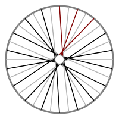
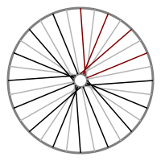
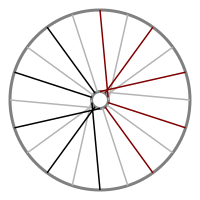
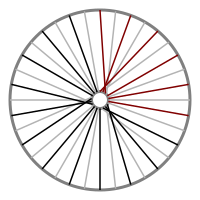

# A Catalogue Of Spoke Patterns

This will be a [complete](#complete) catalogue of [valid](#validity)
spoke patterns to [length](#pattern-length) 6 with
[offsets](#spoke-offsets) of 3 or less.  There is no guarantee of
[safety or practicality](#safety-and-practicality) - in fact, **some
patterns are unsafe or impractical**.

## Contents

* [Catalogue](#catalogue)
* [Notes](#notes)
  * [Pattern Names](#pattern-names)
    * [Spoke Offsets](#spoke-offsets)
    * [Pattern Groups](#pattern-groups)
    * [Pattern Length](#pattern-length)
    * [Preferred Names](#preferred-names)
  * [Validity](#validity)
  * [Rim Compatability](#rim-compatability)
  * [Safety And Practicality](#safety-and-practicality)
  * [Completeness](#completeness)
  * [Footnotes](#footnotes)

## Catalogue

<table>
<tr>
<td>2,0A</td><td>3</td>
<td>2,01A</td><td>4</td>
<td>2,02A</td><td>5</td>
<td>2,03A</td><td>6</td>
</tr>
<tr>
<td colspan="2"></td>
<td colspan="2"></td>
<td colspan="2"></td>
<td colspan="2"></td>
</tr>
</table>

## Notes

### Pattern Names

The patterns above have names like 2,0A1.  Below I describe these in
detail, but all you really need to know is:

* The numbers are spoke offsets.

* For A patterns, reflect the spokes described by the offsets around
  trailing 0 offset (radial) spoke.

* For B patterns, reflect all the spokes.

* C patterns are written out completely.

* Any trailing digit gives the number of additional radial spokes.

So 2,0A1 consists of

* an offset 2 spoke (the "2"),

* a radial spoke (the "0"),

* an offset -2 spoke (the first spoke, reflected, because of "A"),

* a single "extra" radial spoke (the trailing "1"),

and so is better known as the Adapated Crow's Foot.

To write this software and organise the results into the catalogue
above I have had to invent some terms.  My apologies if these are
confusing, or replace / conflict with existing usage.

#### Spoke Offsets

We can describe spokes as being offset by some number of holes
relative to where a radial spoke would connect to the rim.  A spoke of
"offset 1" is shifted one place to the right (in practice, that is two
rim holes, because the intermediate hole is used to connected to the
other side of the hub).  A negative offset is the same number of holes
in the opposite direction.

So a traditional 3 Cross pattern has spokes with offset 3 and -3,
while a radially spoked wheel has spokes of offset 0.

#### Pattern Length

Practical spoke patterns repeat around the wheel, so instead of
describing the whole wheel we can describe just a single occurrence of
the pattern - a single "slice of the pie".

The number of spokes in the slice is called the *length* of the
pattern (see [rim compatability](#rim-compatibility)).

Sometimes I use the word "pattern" to refer to an entire wheel, and
sometimes to just the "pie slice".  Hopefully this will be clear from
the context.

#### Pattern Groups

In practice, common spoke patterns are symmetric - the "slice of pie"
can be divided in two and the spokes on the left are a mirror
reflection of those on the right.

For example, the Crow's Feet pattern consists of three spokes, with
offsets 2, 0 and -2.  Spokes with negative offsets are reflections of
their positive value, so we can describe Crow's Feet as a spoke of
offset 2 reflected around a radial spoke (of offset 0).

Thinking about symmetry in this way lets us divide spoke patterns into
three groups:

* **A**: Patterns like Crow's foot, where there is a radial spoke
  (offset 0) in the middle.

  I write these patterns omitting the the reflected spokes (but
  including the middle spoke).  So Crow's foot can be written as 2,0A.

* **B**: Patterns with an even number of spokes, without a middle
  radial spoke.  A very common example is 3 Cross, which is simply a 3
  offset spoke and a reflected -3 offset spoke, repeated around the
  wheel.

  I write these patterns omitting the reflected spokes.  So 3 Cross is
  simply 3B.

* **C**: Everything else.  In other words, patterns that are not
  symmetric as described above (but see [radial
  padding](#radial-padding) below).

  I write these patterns out completely.  For example TODO.

#### Radial Padding

When you have a pattern that defines a "slice of pie" you can usually
make a new pattern by adding another radial spoke to one side.

These patterns aren't very interesting, but can sometimes be useful.
For example, the Adapted Crow's Foot pattern has an extra radial
spoke, making its length 4 (ordinary Crow's Foot has 3 spokes in a
"slice of pie").

Instead of writing these patterns out as type C, I add the number of
extra radial spokes after the pattern letter.  So Adapted Crow's Foot
is written as 2,0A1 (ordinary Crow's Foot is 2,0A).

For consistency, C patterns (if any - TODO) with trailing zeroes are
also written in this way.

#### Preferred Names

Many patterns can have more than one name.  For example, you could
describe a traditional 3 Cross pattern as "3B", "3B0", "3,-3C" or even
"3,-3,3,-3C" etc.

To avoid duplication I use the following rules:

* Always prefer group A over B, and B over C.

* Omit [radial padding](#radial-padding) of zero.

* Except for the 0A Radial pattern, omit leading and trailing radial
  (0 offset) spokes (except those added with [radial
  padding](#radial-padding)).

* Always start with a positive offset (any pattern can be "reversed"
  by changing the sign of all offsets - this is equivalent to lacing
  the pattern anti-clockwise instead of clockwise).  TODO - something
  wrong here....  consider A groups.

* The above may still not exclude all duplications.  So I also check
  for rotations of C patterns and discard anything that can be
  expressed as an "earlier" name[1](#footnote-1).

### Validity

Not every pattern described by a name can be built in practice.  When
generating the catalogue I discard:

* Patterns with multiple spokes at a single spoke hole (or,
  equivalently, patterns where not all spoke holes are filled).

* Patterns with "unbalanced rotation".  For example, a radially spoked
  wheel is "the same" as one where all the spokes are offset by one
  hole - when you actually build the wheel with offset spokes
  (ignoring problems with spoke length) the spokes would tighten until
  they were radial.

  So patterns which have spokes offset in one direction must also have
  at least one spoke offset in the opposite direction.  This excludes
  the most obvious problems but still allows patterns where rotational
  forces in the two directions are carried by different numbers of
  spokes (because these patterns are not symmetric they are all
  group C).

### Rim Compatability

A pattern of length N can be used in any wheel with a
multiple[2](#footnote-2) of 2N spoke holes, providing the
crosses are possible without spokes overlapping heads.  So a pattern
of length 3 (like Crow's Foot) can be used with 36 hole rims, and a
pattern of length 2 (like 3 Cross) can be used with pretty much any
rim as long as the hub can accommodate the spoke angles.

The illustrations typically show 32 hole rims, unless that is
incompatible with a particular pattern.

### Safety And Practicality

The patterns shown here are generated by a computer program that
considers every possible combination **without considering how safe
or practical the design may be**.

Safe, practical spoke designs distribute forces (from tension,
acceleration, braking and collisions) evenly around the rim.  The
appropriate choice of pattern for a wheel will depend on many
different factors and **should be made by an expert wheel-builder**.

### Completeness

This catalogue is restricted to:

* A single wheel side.  The illustrations show spokes at both sides of
  the wheel, but I do not consider different relative offsets of the
  two sides, or even using a different pattern on each side.

* Straight spokes.  I have not included "snowflake" patterns and
  other, similar designs where spokes are wrapped around each other.

* Completely spoked wheels.  I have not considered gaps / missing
  spokes.

* Patterns where, going round the rim, spokes alternate from one side
  of the hub to the other (many rims are drilled to reflect this
  practice).  See [spoke offsets](#spoke-offsets).

* [Valid](#validity) patterns.

* Spoke [offsets](#spoke-offsets) of 3 (or less).

* Repeated patterns of [length](#pattern-length) 6 (or less).

Apart from these limitations, the catalogue should be complete as it
is generated by a computer program that searches for all
possibilities.  If you find a pattern that is missing please contact
me as it may mean I have a bug in my program!

### Footnotes

**<a name="footnote-1">1</a>** - More exactly, I check against a
lexical sorting based on numerical values, but where negative values
come later.  More exactly still, please see the code.

**<a name="footnote-2">2</a>** - I think this can be shown using
[modular
arithmetic](https://en.wikipedia.org/wiki/Modular_arithmetic).
