# A Catalogue Of Spoke Patterns - Group C

This page contains the unsymmetric group C patterns.  For the
symmetric group A and B patterns, and background information, please
see the [main page](README.md).

For each pattern the [name](REAMDE.md#pattern-names) and
[length](REAMDE.md#pattern-length) are given.  Then an example wheel
(of 20, 32 or 36 spokes, depending on the pattern size) is shown, with
the pattern highlighted in red.

<table>
<tr>
<td>3,-1C</td>
<td>1,-3C</td>
<td>1,-2,1C</td>
<td>2,-3,1C</td>
<td>2,-1,2C</td>
<td>3,-2,2C</td>
<td>1,-1,3C</td>
</tr>
<tr>
<td>2</td>
<td>2</td>
<td>3</td>
<td>3</td>
<td>3</td>
<td>3</td>
<td>3</td>
<tr>
<td></td>
<td></td>
<td>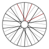</td>
<td></td>
<td>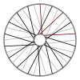</td>
<td>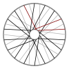</td>
<td></td>
</tr>
<tr>
<td>3,-3,3C</td>
<td>2,-1,-1C</td>
<td>2,-1,-1C1</td>
<td>2,-1,-1C2</td>
<td>2,-1,-1C3</td>
<td>3,-2,-1C</td>
<td>1,-2,-2C</td>
</tr>
<tr>
<td>3</td>
<td>3</td>
<td>4</td>
<td>5</td>
<td>6</td>
<td>3</td>
<td>3</td>
<tr>
<td>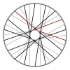</td>
<td></td>
<td></td>
<td></td>
<td></td>
<td></td>
<td></td>
</tr>
<tr>
<td>2,-3,-2C</td>
<td>1,-1,-3C</td>
<td>3,-3,-3C</td>
<td>1,-3,2C1</td>
<td>2,-1,3C1</td>
<td>2,3,-1C1</td>
<td>1,-3,-2C1</td>
</tr>
<tr>
<td>3</td>
<td>3</td>
<td>3</td>
<td>4</td>
<td>4</td>
<td>4</td>
<td>4</td>
<tr>
<td></td>
<td></td>
<td></td>
<td>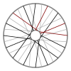</td>
<td>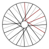</td>
<td>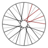</td>
<td>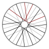</td>
</tr>
<tr>
<td>1,-2,0,1C</td>
<td>1,-3,1,1C</td>
<td>2,-2,3,1C</td>
<td>3,-3,3,1C</td>
<td>3,1,-1,1C</td>
<td>2,2,-1,1C</td>
<td>2,0,-3,1C</td>
</tr>
<tr>
<td>4</td>
<td>4</td>
<td>4</td>
<td>4</td>
<td>4</td>
<td>4</td>
<td>4</td>
<tr>
<td>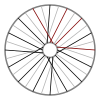</td>
<td>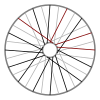</td>
<td>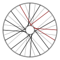</td>
<td>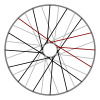</td>
<td>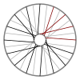</td>
<td>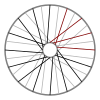</td>
<td>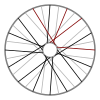</td>
</tr>
<tr>
<td>1,-3,-3,1C</td>
<td>2,-2,2,2C</td>
<td>3,-3,2,2C</td>
<td>3,1,-2,2C</td>
<td>2,-1,-3,2C</td>
<td>3,-1,3,3C</td>
<td>3,-1,-1,3C</td>
</tr>
<tr>
<td>4</td>
<td>4</td>
<td>4</td>
<td>4</td>
<td>4</td>
<td>4</td>
<td>4</td>
<tr>
<td>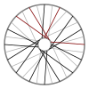</td>
<td>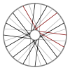</td>
<td>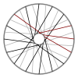</td>
<td>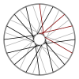</td>
<td>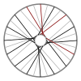</td>
<td>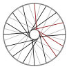</td>
<td>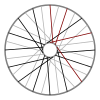</td>
</tr>
<tr>
<td>3,0,-2,3C</td>
<td>1,-2,-2,3C</td>
<td>3,-1,-1,-1C</td>
<td>3,-1,-1,-1C1</td>
<td>3,-1,-1,-1C2</td>
<td>3,0,-2,-1C</td>
<td>3,0,-2,-1C1</td>
</tr>
<tr>
<td>4</td>
<td>4</td>
<td>4</td>
<td>5</td>
<td>6</td>
<td>4</td>
<td>5</td>
<tr>
<td></td>
<td></td>
<td></td>
<td></td>
<td></td>
<td></td>
<td></td>
</tr>
<tr>
<td>3,0,-2,-1C2</td>
<td>1,-2,-2,-1C</td>
<td>1,-1,-3,-1C</td>
<td>3,-1,0,-2C</td>
<td>3,-1,0,-2C1</td>
<td>3,-1,0,-2C2</td>
<td>3,-3,2,-2C</td>
</tr>
<tr>
<td>6</td>
<td>4</td>
<td>4</td>
<td>4</td>
<td>5</td>
<td>6</td>
<td>4</td>
<tr>
<td></td>
<td></td>
<td></td>
<td></td>
<td></td>
<td></td>
<td>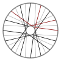</td>
</tr>
<tr>
<td>2,-2,-2,-2C</td>
<td>3,-3,-2,-2C</td>
<td>2,-1,-3,-2C</td>
<td>1,-2,0,-3C</td>
<td>2,-2,-1,-3C</td>
<td>3,-3,-1,-3C</td>
<td>2,0,-3,-3C</td>
</tr>
<tr>
<td>4</td>
<td>4</td>
<td>4</td>
<td>4</td>
<td>4</td>
<td>4</td>
<td>4</td>
<tr>
<td></td>
<td></td>
<td></td>
<td></td>
<td></td>
<td></td>
<td></td>
</tr>
<tr>
<td>1,-3,-3,-3C</td>
<td>1,-3,0,2C1</td>
<td>3,1,-1,2C1</td>
<td>2,2,-1,2C1</td>
<td>2,-3,-1,2C1</td>
<td>3,-1,0,3C1</td>
<td>2,-1,1,3C1</td>
</tr>
<tr>
<td>4</td>
<td>5</td>
<td>5</td>
<td>5</td>
<td>5</td>
<td>5</td>
<td>5</td>
<tr>
<td></td>
<td>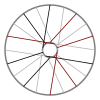</td>
<td>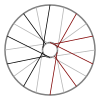</td>
<td>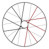</td>
<td>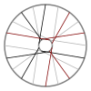</td>
<td>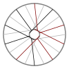</td>
<td>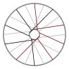</td>
</tr>
<tr>
<td>2,-3,3,3C1</td>
<td>3,1,-2,3C1</td>
<td>2,2,-2,3C1</td>
<td>2,-3,-2,3C1</td>
<td>1,2,3,-1C1</td>
<td>1,-3,-2,-1C1</td>
<td>3,1,3,-2C1</td>
</tr>
<tr>
<td>5</td>
<td>5</td>
<td>5</td>
<td>5</td>
<td>5</td>
<td>5</td>
<td>5</td>
<tr>
<td>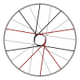</td>
<td>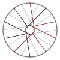</td>
<td>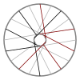</td>
<td>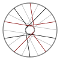</td>
<td>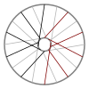</td>
<td>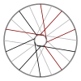</td>
<td>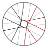</td>
</tr>
<tr>
<td>2,2,3,-2C1</td>
<td>2,-3,-2,-2C1</td>
<td>1,-3,0,-3C1</td>
<td>2,-3,-1,-3C1</td>
<td>1,-2,0,0,1C</td>
<td>2,0,-3,0,1C</td>
<td>1,1,-3,0,1C</td>
</tr>
<tr>
<td>5</td>
<td>5</td>
<td>5</td>
<td>5</td>
<td>5</td>
<td>5</td>
<td>5</td>
<tr>
<td>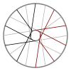</td>
<td>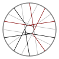</td>
<td></td>
<td>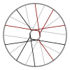</td>
<td>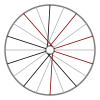</td>
<td>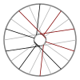</td>
<td>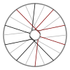</td>
</tr>
<tr>
<td>3,1,-1,1,1C</td>
<td>2,2,-1,1,1C</td>
<td>2,-3,-1,1,1C</td>
<td>2,-2,1,3,1C</td>
<td>2,-3,2,3,1C</td>
<td>3,1,-3,3,1C</td>
<td>2,2,-3,3,1C</td>
</tr>
<tr>
<td>5</td>
<td>5</td>
<td>5</td>
<td>5</td>
<td>5</td>
<td>5</td>
<td>5</td>
<tr>
<td>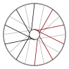</td>
<td>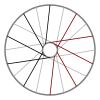</td>
<td>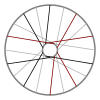</td>
<td>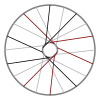</td>
<td>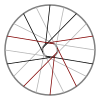</td>
<td>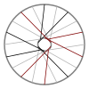</td>
<td>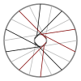</td>
</tr>
<tr>
<td>2,-3,-3,3,1C</td>
<td>1,-2,1,-1,1C</td>
<td>1,-3,2,-1,1C</td>
<td>3,3,-1,-1,1C</td>
<td>3,-2,-1,-1,1C</td>
<td>1,-3,-3,-1,1C</td>
<td>3,3,0,-2,1C</td>
</tr>
<tr>
<td>5</td>
<td>5</td>
<td>5</td>
<td>5</td>
<td>5</td>
<td>5</td>
<td>5</td>
<tr>
<td>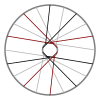</td>
<td></td>
<td></td>
<td></td>
<td></td>
<td></td>
<td></td>
</tr>
<tr>
<td>3,-2,0,-2,1C</td>
<td>2,3,1,-2,1C</td>
<td>2,-2,1,-2,1C</td>
<td>2,2,2,-2,1C</td>
<td>2,-3,2,-2,1C</td>
<td>3,1,-3,-2,1C</td>
<td>2,2,-3,-2,1C</td>
</tr>
<tr>
<td>5</td>
<td>5</td>
<td>5</td>
<td>5</td>
<td>5</td>
<td>5</td>
<td>5</td>
<tr>
<td></td>
<td></td>
<td></td>
<td></td>
<td></td>
<td></td>
<td></td>
</tr>
<tr>
<td>2,-3,-3,-2,1C</td>
<td>2,-1,-3,0,2C</td>
<td>2,-3,2,2,2C</td>
<td>3,1,-3,2,2C</td>
<td>2,-3,-3,2,2C</td>
<td>3,-1,2,-1,2C</td>
<td>3,3,3,-1,2C</td>
</tr>
<tr>
<td>5</td>
<td>5</td>
<td>5</td>
<td>5</td>
<td>5</td>
<td>5</td>
<td>5</td>
<tr>
<td></td>
<td></td>
<td></td>
<td></td>
<td></td>
<td></td>
<td></td>
</tr>
<tr>
<td>3,-2,3,-1,2C</td>
<td>3,3,-2,-1,2C</td>
<td>3,-2,-2,-1,2C</td>
<td>3,-1,-3,-1,2C</td>
<td>3,3,0,-3,2C</td>
<td>3,-2,0,-3,2C</td>
<td>2,-2,1,-3,2C</td>
</tr>
<tr>
<td>5</td>
<td>5</td>
<td>5</td>
<td>5</td>
<td>5</td>
<td>5</td>
<td>5</td>
<tr>
<td></td>
<td></td>
<td></td>
<td></td>
<td></td>
<td></td>
<td></td>
</tr>
<tr>
<td>2,-3,2,-3,2C</td>
<td>3,1,-3,-3,2C</td>
<td>2,-3,-3,-3,2C</td>
<td>1,-2,-2,0,3C</td>
<td>3,-2,3,3,3C</td>
<td>3,-2,-2,3,3C</td>
<td>3,-1,-3,3,3C</td>
</tr>
<tr>
<td>5</td>
<td>5</td>
<td>5</td>
<td>5</td>
<td>5</td>
<td>5</td>
<td>5</td>
<tr>
<td></td>
<td></td>
<td></td>
<td></td>
<td></td>
<td></td>
<td></td>
</tr>
<tr>
<td>3,-1,2,-2,3C</td>
<td>3,-2,3,-2,3C</td>
<td>3,-2,-2,-2,3C</td>
<td>3,-1,-3,-2,3C</td>
<td>1,-2,1,-3,3C</td>
<td>1,-3,2,-3,3C</td>
<td>3,-2,-1,-3,3C</td>
</tr>
<tr>
<td>5</td>
<td>5</td>
<td>5</td>
<td>5</td>
<td>5</td>
<td>5</td>
<td>5</td>
<tr>
<td></td>
<td></td>
<td></td>
<td></td>
<td></td>
<td></td>
<td></td>
</tr>
<tr>
<td>1,-3,-3,-3,3C</td>
<td>2,-1,-1,1,-1C</td>
<td>2,-1,-1,1,-1C1</td>
<td>2,0,-2,1,-1C</td>
<td>2,0,-2,1,-1C1</td>
<td>2,-2,-1,2,-1C</td>
<td>2,0,-3,2,-1C</td>
</tr>
<tr>
<td>5</td>
<td>5</td>
<td>6</td>
<td>5</td>
<td>6</td>
<td>5</td>
<td>5</td>
<tr>
<td></td>
<td></td>
<td></td>
<td></td>
<td></td>
<td></td>
<td></td>
</tr>
<tr>
<td>2,-2,-2,3,-1C</td>
<td>2,-1,-3,3,-1C</td>
<td>1,-2,3,-1,-1C</td>
<td>1,-2,-2,-1,-1C</td>
<td>1,-1,-3,-1,-1C</td>
<td>2,-2,3,-2,-1C</td>
<td>2,-2,-2,-2,-1C</td>
</tr>
<tr>
<td>5</td>
<td>5</td>
<td>5</td>
<td>5</td>
<td>5</td>
<td>5</td>
<td>5</td>
<tr>
<td></td>
<td></td>
<td></td>
<td></td>
<td></td>
<td></td>
<td></td>
</tr>
<tr>
<td>2,-1,-3,-2,-1C</td>
<td>1,-2,0,-3,-1C</td>
<td>2,-2,-1,-3,-1C</td>
<td>2,0,-3,-3,-1C</td>
<td>1,-2,3,0,-2C</td>
<td>1,-2,-2,0,-2C</td>
<td>1,-1,-3,0,-2C</td>
</tr>
<tr>
<td>5</td>
<td>5</td>
<td>5</td>
<td>5</td>
<td>5</td>
<td>5</td>
<td>5</td>
<tr>
<td></td>
<td></td>
<td></td>
<td></td>
<td></td>
<td></td>
<td></td>
</tr>
<tr>
<td>1,-3,-2,1,-2C</td>
<td>3,0,-3,2,-2C</td>
<td>1,-3,-3,2,-2C</td>
<td>3,-2,-2,3,-2C</td>
<td>3,-1,-3,3,-2C</td>
<td>3,-2,-2,-2,-2C</td>
<td>3,-1,-3,-2,-2C</td>
</tr>
<tr>
<td>5</td>
<td>5</td>
<td>5</td>
<td>5</td>
<td>5</td>
<td>5</td>
<td>5</td>
<tr>
<td></td>
<td></td>
<td></td>
<td></td>
<td></td>
<td></td>
<td></td>
</tr>
<tr>
<td>1,-3,2,-3,-2C</td>
<td>3,-2,-1,-3,-2C</td>
<td>3,0,-3,-3,-2C</td>
<td>1,-3,-3,-3,-2C</td>
<td>2,-2,-2,0,-3C</td>
<td>2,-1,-3,0,-3C</td>
<td>2,-3,-3,2,-3C</td>
</tr>
<tr>
<td>5</td>
<td>5</td>
<td>5</td>
<td>5</td>
<td>5</td>
<td>5</td>
<td>5</td>
<tr>
<td></td>
<td></td>
<td></td>
<td></td>
<td></td>
<td></td>
<td></td>
</tr>
<tr>
<td>3,-2,-2,-1,-3C</td>
<td>3,-1,-3,-1,-3C</td>
<td>3,-2,0,-3,-3C</td>
<td>2,-3,-3,-3,-3C</td>
<td>3,1,-1,3C2</td>
<td>2,2,-1,3C2</td>
<td>1,-3,0,0,2C1</td>
</tr>
<tr>
<td>5</td>
<td>5</td>
<td>5</td>
<td>5</td>
<td>6</td>
<td>6</td>
<td>6</td>
<tr>
<td></td>
<td></td>
<td></td>
<td></td>
<td></td>
<td></td>
<td></td>
</tr>
<tr>
<td>2,3,-1,0,2C1</td>
<td>2,-3,-1,0,2C1</td>
<td>3,1,-1,1,2C1</td>
<td>2,2,-1,1,2C1</td>
<td>1,3,1,-1,2C1</td>
<td>1,-3,1,-1,2C1</td>
<td>3,0,2,-1,2C1</td>
</tr>
<tr>
<td>6</td>
<td>6</td>
<td>6</td>
<td>6</td>
<td>6</td>
<td>6</td>
<td>6</td>
<tr>
<td></td>
<td></td>
<td></td>
<td></td>
<td></td>
<td></td>
<td></td>
</tr>
<tr>
<td>1,2,2,-1,2C1</td>
<td>3,3,-1,-1,2C1</td>
<td>3,-3,-1,-1,2C1</td>
<td>3,3,0,-2,2C1</td>
<td>2,3,1,-2,2C1</td>
<td>2,-3,1,-2,2C1</td>
<td>3,1,2,-2,2C1</td>
</tr>
<tr>
<td>6</td>
<td>6</td>
<td>6</td>
<td>6</td>
<td>6</td>
<td>6</td>
<td>6</td>
<tr>
<td></td>
<td></td>
<td></td>
<td></td>
<td></td>
<td></td>
<td></td>
</tr>
<tr>
<td>2,2,2,-2,2C1</td>
<td>2,3,-2,0,3C1</td>
<td>2,-3,-2,0,3C1</td>
<td>3,-1,0,1,3C1</td>
<td>2,-1,1,1,3C1</td>
<td>3,1,-2,1,3C1</td>
<td>2,2,-2,1,3C1</td>
</tr>
<tr>
<td>6</td>
<td>6</td>
<td>6</td>
<td>6</td>
<td>6</td>
<td>6</td>
<td>6</td>
<tr>
<td></td>
<td></td>
<td></td>
<td></td>
<td></td>
<td></td>
<td></td>
</tr>
<tr>
<td>3,-3,0,3,3C1</td>
<td>2,-3,1,3,3C1</td>
<td>3,-1,2,-1,3C1</td>
<td>3,3,-2,-1,3C1</td>
<td>3,-3,-2,-1,3C1</td>
<td>3,3,0,-3,3C1</td>
<td>2,3,1,-3,3C1</td>
</tr>
<tr>
<td>6</td>
<td>6</td>
<td>6</td>
<td>6</td>
<td>6</td>
<td>6</td>
<td>6</td>
<tr>
<td></td>
<td></td>
<td></td>
<td></td>
<td></td>
<td></td>
<td></td>
</tr>
<tr>
<td>2,-3,1,-3,3C1</td>
<td>3,1,2,-3,3C1</td>
<td>2,2,2,-3,3C1</td>
<td>1,1,2,3,-1C1</td>
<td>2,3,-1,3,-1C1</td>
<td>2,-3,-1,3,-1C1</td>
<td>1,-3,-2,-1,-1C1</td>
</tr>
<tr>
<td>6</td>
<td>6</td>
<td>6</td>
<td>6</td>
<td>6</td>
<td>6</td>
<td>6</td>
<tr>
<td></td>
<td></td>
<td></td>
<td></td>
<td></td>
<td></td>
<td></td>
</tr>
<tr>
<td>2,-3,-2,-2,-1C1</td>
<td>1,-3,0,-3,-1C1</td>
<td>2,-3,-1,-3,-1C1</td>
<td>1,-3,-2,0,-2C1</td>
<td>1,3,1,3,-2C1</td>
<td>1,-3,1,3,-2C1</td>
<td>1,2,2,3,-2C1</td>
</tr>
<tr>
<td>6</td>
<td>6</td>
<td>6</td>
<td>6</td>
<td>6</td>
<td>6</td>
<td>6</td>
<tr>
<td></td>
<td></td>
<td></td>
<td></td>
<td></td>
<td></td>
<td></td>
</tr>
<tr>
<td>3,3,-1,3,-2C1</td>
<td>3,-3,-1,3,-2C1</td>
<td>3,-3,-2,-2,-2C1</td>
<td>1,-3,1,-3,-2C1</td>
<td>3,-3,-1,-3,-2C1</td>
<td>2,-3,-2,0,-3C1</td>
<td>2,3,1,3,-3C1</td>
</tr>
<tr>
<td>6</td>
<td>6</td>
<td>6</td>
<td>6</td>
<td>6</td>
<td>6</td>
<td>6</td>
<tr>
<td></td>
<td></td>
<td></td>
<td></td>
<td></td>
<td></td>
<td></td>
</tr>
<tr>
<td>2,-3,1,3,-3C1</td>
<td>3,1,2,3,-3C1</td>
<td>2,2,2,3,-3C1</td>
<td>3,-3,-2,-1,-3C1</td>
<td>3,-3,0,-3,-3C1</td>
<td>2,-3,1,-3,-3C1</td>
<td>1,-2,0,0,0,1C</td>
</tr>
<tr>
<td>6</td>
<td>6</td>
<td>6</td>
<td>6</td>
<td>6</td>
<td>6</td>
<td>6</td>
<tr>
<td></td>
<td></td>
<td></td>
<td></td>
<td></td>
<td></td>
<td></td>
</tr>
<tr>
<td>2,0,-3,0,0,1C</td>
<td>1,1,-3,0,0,1C</td>
<td>1,-2,1,-1,0,1C</td>
<td>3,-2,-1,-1,0,1C</td>
<td>1,2,-3,-1,0,1C</td>
<td>3,-2,0,-2,0,1C</td>
<td>2,-2,1,-2,0,1C</td>
</tr>
<tr>
<td>6</td>
<td>6</td>
<td>6</td>
<td>6</td>
<td>6</td>
<td>6</td>
<td>6</td>
<tr>
<td></td>
<td></td>
<td></td>
<td></td>
<td></td>
<td></td>
<td></td>
</tr>
<tr>
<td>3,1,-3,-2,0,1C</td>
<td>2,2,-3,-2,0,1C</td>
<td>3,1,-1,1,1,1C</td>
<td>2,2,-1,1,1,1C</td>
<td>1,-3,1,-1,1,1C</td>
<td>3,3,-1,-1,1,1C</td>
<td>3,3,0,-2,1,1C</td>
</tr>
<tr>
<td>6</td>
<td>6</td>
<td>6</td>
<td>6</td>
<td>6</td>
<td>6</td>
<td>6</td>
<tr>
<td></td>
<td></td>
<td></td>
<td></td>
<td></td>
<td></td>
<td></td>
</tr>
<tr>
<td>3,-3,0,-2,1,1C</td>
<td>2,3,1,-2,1,1C</td>
<td>2,-3,1,-2,1,1C</td>
<td>3,1,2,-2,1,1C</td>
<td>2,2,2,-2,1,1C</td>
<td>2,-3,-3,0,3,1C</td>
<td>3,1,-3,1,3,1C</td>
</tr>
<tr>
<td>6</td>
<td>6</td>
<td>6</td>
<td>6</td>
<td>6</td>
<td>6</td>
<td>6</td>
<tr>
<td></td>
<td></td>
<td></td>
<td></td>
<td></td>
<td></td>
<td></td>
</tr>
<tr>
<td>2,2,-3,1,3,1C</td>
<td>2,-3,1,2,3,1C</td>
<td>3,-2,2,-1,3,1C</td>
<td>3,3,3,-1,3,1C</td>
<td>3,-3,3,-1,3,1C</td>
<td>3,3,-3,-1,3,1C</td>
<td>3,-3,-3,-1,3,1C</td>
</tr>
<tr>
<td>6</td>
<td>6</td>
<td>6</td>
<td>6</td>
<td>6</td>
<td>6</td>
<td>6</td>
<tr>
<td></td>
<td></td>
<td></td>
<td></td>
<td></td>
<td></td>
<td></td>
</tr>
<tr>
<td>1,-2,0,1,-1,1C</td>
<td>2,-2,-1,1,-1,1C</td>
<td>2,0,-3,1,-1,1C</td>
<td>1,-3,0,2,-1,1C</td>
<td>2,3,-1,2,-1,1C</td>
<td>2,-3,-1,2,-1,1C</td>
<td>1,-3,-3,-1,-1,1C</td>
</tr>
<tr>
<td>6</td>
<td>6</td>
<td>6</td>
<td>6</td>
<td>6</td>
<td>6</td>
<td>6</td>
<tr>
<td></td>
<td></td>
<td></td>
<td></td>
<td></td>
<td></td>
<td></td>
</tr>
<tr>
<td>2,3,3,-2,-1,1C</td>
<td>2,-3,-3,-2,-1,1C</td>
<td>1,-2,2,0,-2,1C</td>
<td>1,-3,3,0,-2,1C</td>
<td>1,-3,-3,0,-2,1C</td>
<td>3,-2,-1,1,-2,1C</td>
<td>3,0,-3,1,-2,1C</td>
</tr>
<tr>
<td>6</td>
<td>6</td>
<td>6</td>
<td>6</td>
<td>6</td>
<td>6</td>
<td>6</td>
<tr>
<td></td>
<td></td>
<td></td>
<td></td>
<td></td>
<td></td>
<td></td>
</tr>
<tr>
<td>1,-3,1,2,-2,1C</td>
<td>3,3,-1,2,-2,1C</td>
<td>3,-3,-1,2,-2,1C</td>
<td>3,-2,2,-2,-2,1C</td>
<td>3,3,3,-2,-2,1C</td>
<td>3,-3,3,-2,-2,1C</td>
<td>3,3,-3,-2,-2,1C</td>
</tr>
<tr>
<td>6</td>
<td>6</td>
<td>6</td>
<td>6</td>
<td>6</td>
<td>6</td>
<td>6</td>
<tr>
<td></td>
<td></td>
<td></td>
<td></td>
<td></td>
<td></td>
<td></td>
</tr>
<tr>
<td>3,-3,-3,-2,-2,1C</td>
<td>2,-2,2,0,-3,1C</td>
<td>2,3,3,0,-3,1C</td>
<td>2,-3,3,0,-3,1C</td>
<td>2,3,-3,0,-3,1C</td>
<td>2,-3,-3,0,-3,1C</td>
<td>2,2,3,1,-3,1C</td>
</tr>
<tr>
<td>6</td>
<td>6</td>
<td>6</td>
<td>6</td>
<td>6</td>
<td>6</td>
<td>6</td>
<tr>
<td></td>
<td></td>
<td></td>
<td></td>
<td></td>
<td></td>
<td></td>
</tr>
<tr>
<td>3,1,-3,1,-3,1C</td>
<td>2,2,-3,1,-3,1C</td>
<td>2,2,2,2,-3,1C</td>
<td>3,-2,2,-1,-3,1C</td>
<td>3,3,3,-1,-3,1C</td>
<td>3,-3,3,-1,-3,1C</td>
<td>3,3,-3,-1,-3,1C</td>
</tr>
<tr>
<td>6</td>
<td>6</td>
<td>6</td>
<td>6</td>
<td>6</td>
<td>6</td>
<td>6</td>
<tr>
<td></td>
<td></td>
<td></td>
<td></td>
<td></td>
<td></td>
<td></td>
</tr>
<tr>
<td>3,-3,-3,-1,-3,1C</td>
<td>2,-1,-3,0,0,2C</td>
<td>3,-2,-2,-1,0,2C</td>
<td>3,-1,-3,-1,0,2C</td>
<td>3,-2,0,-3,0,2C</td>
<td>2,-2,1,-3,0,2C</td>
<td>3,1,-3,-3,0,2C</td>
</tr>
<tr>
<td>6</td>
<td>6</td>
<td>6</td>
<td>6</td>
<td>6</td>
<td>6</td>
<td>6</td>
<tr>
<td></td>
<td></td>
<td></td>
<td></td>
<td></td>
<td></td>
<td></td>
</tr>
<tr>
<td>2,2,-3,-3,0,2C</td>
<td>3,-2,2,-1,2,2C</td>
<td>3,3,3,-1,2,2C</td>
<td>3,-3,3,-1,2,2C</td>
<td>3,3,-3,-1,2,2C</td>
<td>3,-3,-3,-1,2,2C</td>
<td>2,-1,3,1,-1,2C</td>
</tr>
<tr>
<td>6</td>
<td>6</td>
<td>6</td>
<td>6</td>
<td>6</td>
<td>6</td>
<td>6</td>
<tr>
<td></td>
<td></td>
<td></td>
<td></td>
<td></td>
<td></td>
<td></td>
</tr>
<tr>
<td>2,-2,-2,1,-1,2C</td>
<td>2,-1,-3,1,-1,2C</td>
<td>2,-3,-2,2,-1,2C</td>
<td>2,-2,2,3,-1,2C</td>
<td>2,-3,3,3,-1,2C</td>
<td>2,-3,-3,3,-1,2C</td>
<td>2,-2,2,-3,-1,2C</td>
</tr>
<tr>
<td>6</td>
<td>6</td>
<td>6</td>
<td>6</td>
<td>6</td>
<td>6</td>
<td>6</td>
<tr>
<td></td>
<td></td>
<td></td>
<td></td>
<td></td>
<td></td>
<td></td>
</tr>
<tr>
<td>2,-3,3,-3,-1,2C</td>
<td>2,-3,-3,-3,-1,2C</td>
<td>3,-1,3,1,-2,2C</td>
<td>3,-2,-2,1,-2,2C</td>
<td>3,-1,-3,1,-2,2C</td>
<td>3,3,-2,2,-2,2C</td>
<td>3,-3,-2,2,-2,2C</td>
</tr>
<tr>
<td>6</td>
<td>6</td>
<td>6</td>
<td>6</td>
<td>6</td>
<td>6</td>
<td>6</td>
<tr>
<td></td>
<td></td>
<td></td>
<td></td>
<td></td>
<td></td>
<td></td>
</tr>
<tr>
<td>3,3,3,3,-2,2C</td>
<td>3,-3,3,3,-2,2C</td>
<td>3,3,-3,3,-2,2C</td>
<td>3,-3,-3,3,-2,2C</td>
<td>3,3,3,-3,-2,2C</td>
<td>3,-3,-3,-3,-2,2C</td>
<td>1,-2,-2,0,0,3C</td>
</tr>
<tr>
<td>6</td>
<td>6</td>
<td>6</td>
<td>6</td>
<td>6</td>
<td>6</td>
<td>6</td>
<tr>
<td></td>
<td></td>
<td></td>
<td></td>
<td></td>
<td></td>
<td></td>
</tr>
<tr>
<td>3,-2,-2,-2,0,3C</td>
<td>3,-1,-3,-2,0,3C</td>
<td>1,-2,1,-3,0,3C</td>
<td>3,-2,-1,-3,0,3C</td>
<td>3,-3,3,3,3,3C</td>
<td>3,-3,-3,3,3,3C</td>
<td>3,-2,2,-3,3,3C</td>
</tr>
<tr>
<td>6</td>
<td>6</td>
<td>6</td>
<td>6</td>
<td>6</td>
<td>6</td>
<td>6</td>
<tr>
<td></td>
<td></td>
<td></td>
<td></td>
<td></td>
<td></td>
<td></td>
</tr>
<tr>
<td>3,-3,3,-3,3,3C</td>
<td>1,-2,-2,1,-1,3C</td>
<td>1,-1,-3,1,-1,3C</td>
<td>1,-3,-2,2,-1,3C</td>
<td>1,-3,3,3,-1,3C</td>
<td>1,-3,-3,3,-1,3C</td>
<td>1,-2,2,-3,-1,3C</td>
</tr>
<tr>
<td>6</td>
<td>6</td>
<td>6</td>
<td>6</td>
<td>6</td>
<td>6</td>
<td>6</td>
<tr>
<td></td>
<td></td>
<td></td>
<td></td>
<td></td>
<td></td>
<td></td>
</tr>
<tr>
<td>1,-3,3,-3,-1,3C</td>
<td>1,-3,-3,-3,-1,3C</td>
<td>3,-2,-2,1,-3,3C</td>
<td>3,-1,-3,1,-3,3C</td>
<td>3,-3,-2,2,-3,3C</td>
<td>3,-3,-3,3,-3,3C</td>
<td>3,-3,-3,-3,-3,3C</td>
</tr>
<tr>
<td>6</td>
<td>6</td>
<td>6</td>
<td>6</td>
<td>6</td>
<td>6</td>
<td>6</td>
<tr>
<td></td>
<td></td>
<td></td>
<td></td>
<td></td>
<td></td>
<td></td>
</tr>
<tr>
<td>2,-1,-1,0,1,-1C</td>
<td>2,0,-2,0,1,-1C</td>
<td>3,-1,-1,-1,1,-1C</td>
<td>3,0,-2,-1,1,-1C</td>
<td>3,-1,0,-2,1,-1C</td>
<td>3,0,0,-3,1,-1C</td>
<td>2,-2,-1,0,2,-1C</td>
</tr>
<tr>
<td>6</td>
<td>6</td>
<td>6</td>
<td>6</td>
<td>6</td>
<td>6</td>
<td>6</td>
<tr>
<td></td>
<td></td>
<td></td>
<td></td>
<td></td>
<td></td>
<td></td>
</tr>
<tr>
<td>2,0,-3,0,2,-1C</td>
<td>3,-2,-1,-1,2,-1C</td>
<td>3,0,-3,-1,2,-1C</td>
<td>3,-2,0,-2,2,-1C</td>
<td>2,-2,-2,0,3,-1C</td>
<td>2,-1,-3,0,3,-1C</td>
<td>3,-2,-2,-1,3,-1C</td>
</tr>
<tr>
<td>6</td>
<td>6</td>
<td>6</td>
<td>6</td>
<td>6</td>
<td>6</td>
<td>6</td>
<tr>
<td></td>
<td></td>
<td></td>
<td></td>
<td></td>
<td></td>
<td></td>
</tr>
<tr>
<td>3,-1,-3,-1,3,-1C</td>
<td>3,-2,0,-3,3,-1C</td>
<td>2,0,-2,2,-1,-1C</td>
<td>1,-2,0,3,-1,-1C</td>
<td>2,-2,-1,3,-1,-1C</td>
<td>2,0,-3,3,-1,-1C</td>
<td>1,-2,-2,-1,-1,-1C</td>
</tr>
<tr>
<td>6</td>
<td>6</td>
<td>6</td>
<td>6</td>
<td>6</td>
<td>6</td>
<td>6</td>
<tr>
<td></td>
<td></td>
<td></td>
<td></td>
<td></td>
<td></td>
<td></td>
</tr>
<tr>
<td>1,-1,-3,-1,-1,-1C</td>
<td>2,-2,-2,-2,-1,-1C</td>
<td>2,-1,-3,-2,-1,-1C</td>
<td>1,-2,0,-3,-1,-1C</td>
<td>2,-2,-1,-3,-1,-1C</td>
<td>2,0,-3,-3,-1,-1C</td>
<td>1,-2,-2,0,-2,-1C</td>
</tr>
<tr>
<td>6</td>
<td>6</td>
<td>6</td>
<td>6</td>
<td>6</td>
<td>6</td>
<td>6</td>
<tr>
<td></td>
<td></td>
<td></td>
<td></td>
<td></td>
<td></td>
<td></td>
</tr>
<tr>
<td>1,-1,-3,0,-2,-1C</td>
<td>3,0,-2,2,-2,-1C</td>
<td>3,0,-3,3,-2,-1C</td>
<td>3,-2,-2,-2,-2,-1C</td>
<td>3,-1,-3,-2,-2,-1C</td>
<td>1,-2,1,-3,-2,-1C</td>
<td>3,-2,-1,-3,-2,-1C</td>
</tr>
<tr>
<td>6</td>
<td>6</td>
<td>6</td>
<td>6</td>
<td>6</td>
<td>6</td>
<td>6</td>
<tr>
<td></td>
<td></td>
<td></td>
<td></td>
<td></td>
<td></td>
<td></td>
</tr>
<tr>
<td>3,0,-3,-3,-2,-1C</td>
<td>2,-2,-2,0,-3,-1C</td>
<td>2,-1,-3,0,-3,-1C</td>
<td>3,-2,-2,-1,-3,-1C</td>
<td>3,-1,-3,-1,-3,-1C</td>
<td>3,-2,0,-3,-3,-1C</td>
<td>2,-2,1,-3,-3,-1C</td>
</tr>
<tr>
<td>6</td>
<td>6</td>
<td>6</td>
<td>6</td>
<td>6</td>
<td>6</td>
<td>6</td>
<tr>
<td></td>
<td></td>
<td></td>
<td></td>
<td></td>
<td></td>
<td></td>
</tr>
<tr>
<td>1,-2,0,3,0,-2C</td>
<td>1,-2,-2,-1,0,-2C</td>
<td>1,-1,-3,-1,0,-2C</td>
<td>2,-2,-2,-2,0,-2C</td>
<td>2,-1,-3,-2,0,-2C</td>
<td>1,-2,0,-3,0,-2C</td>
<td>2,-2,-1,-3,0,-2C</td>
</tr>
<tr>
<td>6</td>
<td>6</td>
<td>6</td>
<td>6</td>
<td>6</td>
<td>6</td>
<td>6</td>
<tr>
<td></td>
<td></td>
<td></td>
<td></td>
<td></td>
<td></td>
<td></td>
</tr>
<tr>
<td>2,0,-3,-3,0,-2C</td>
<td>2,-3,-2,-2,1,-2C</td>
<td>1,-3,0,-3,1,-2C</td>
<td>2,-3,-1,-3,1,-2C</td>
<td>2,-3,-3,-2,2,-2C</td>
<td>2,-3,-3,-3,3,-2C</td>
<td>1,-1,-3,1,-2,-2C</td>
</tr>
<tr>
<td>6</td>
<td>6</td>
<td>6</td>
<td>6</td>
<td>6</td>
<td>6</td>
<td>6</td>
<tr>
<td></td>
<td></td>
<td></td>
<td></td>
<td></td>
<td></td>
<td></td>
</tr>
<tr>
<td>1,-3,-2,2,-2,-2C</td>
<td>1,-3,-3,3,-2,-2C</td>
<td>1,-3,3,-3,-2,-2C</td>
<td>1,-3,-3,-3,-2,-2C</td>
<td>2,-1,-3,1,-3,-2C</td>
<td>2,-3,-3,3,-3,-2C</td>
<td>2,-3,3,-3,-3,-2C</td>
</tr>
<tr>
<td>6</td>
<td>6</td>
<td>6</td>
<td>6</td>
<td>6</td>
<td>6</td>
<td>6</td>
<tr>
<td></td>
<td></td>
<td></td>
<td></td>
<td></td>
<td></td>
<td></td>
</tr>
<tr>
<td>2,-3,-3,-3,-3,-2C</td>
<td>1,-2,-2,0,0,-3C</td>
<td>1,-1,-3,0,0,-3C</td>
<td>3,-2,-2,-2,0,-3C</td>
<td>3,-1,-3,-2,0,-3C</td>
<td>3,-2,-1,-3,0,-3C</td>
<td>3,0,-3,-3,0,-3C</td>
</tr>
<tr>
<td>6</td>
<td>6</td>
<td>6</td>
<td>6</td>
<td>6</td>
<td>6</td>
<td>6</td>
<tr>
<td></td>
<td></td>
<td></td>
<td></td>
<td></td>
<td></td>
<td></td>
</tr>
<tr>
<td>3,-3,-1,-3,1,-3C</td>
<td>3,-3,-3,-3,3,-3C</td>
<td>1,-3,-3,3,-1,-3C</td>
<td>1,-3,-3,-3,-1,-3C</td>
<td>3,-3,-3,-3,-3,-3C</td>
</tr>
<tr>
<td>6</td>
<td>6</td>
<td>6</td>
<td>6</td>
<td>6</td>
<tr>
<td></td>
<td></td>
<td></td>
<td></td>
<td></td>
</tr>
</table>
